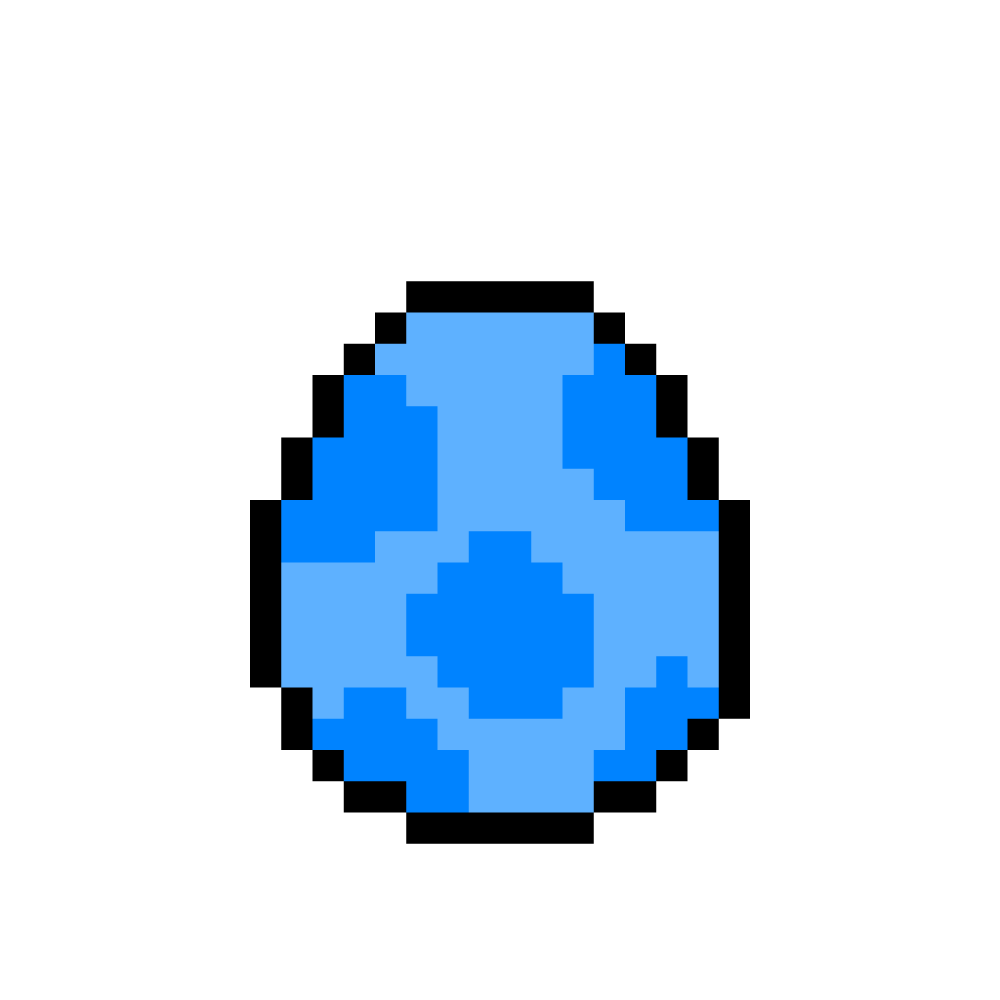
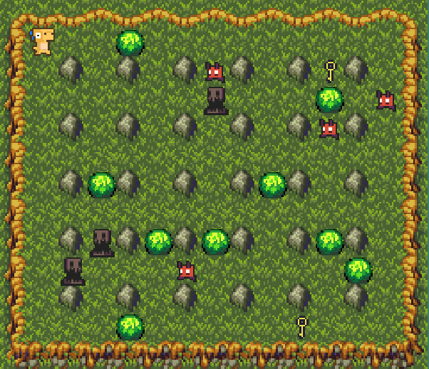
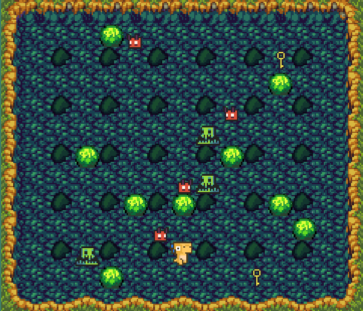

#  BoomBlitz
BoomBlitz is an exciting game where you need to explore a maze full of challenges and dangers. Your mission is to collect keys and avoid enemies. The game is based on a two-dimensional canvas that represents the maze.

## Why we made BoomBlitz?
**BoomBlitz** is a project created by Computer Science students from UFES Vitória for the Integrated Project course of 2023/1, taught by [Joao Paulo Andrade Almeida](https://nemo.inf.ufes.br/equipe/jpalmeida/).
It takes inspiration from the game Bomberman and the desire to experience a game from the developer's perspective.

|  |  |
|:---:|:---:|
| Board 1 | Board 2 |

##  Features
- Movement of the main character (Dino) using arrow keys.
- Validation of movement in relation to walls, enemies, and other elements of the maze.
- Interaction with enemies (Slimes and Demons) that can harm the character.
- Animations for characters and game elements.
- Dynamic canvas that reflects updates to the game state.

## How to play
Access [boom-blitz.vercel.app](boom-blitz.vercel.app) to load the game.

- Use the arrow keys to move the main character (Dino) through the maze.
- Collect keys to win the game.
- Avoid enemies (Slimes and Demons) to prevent defeat.

##   Known Bugs
If the browser is kept in the background, the collision matrix values may become incorrect (floor counts as a monster and kills the player).

## Contributing
Contributions to BoomBlitz are welcome! If you encounter any issues, have suggestions, or want to add new features, feel free to open an issue or submit a pull request.

## License
This project is licensed under the MIT License.

#  Team
[Lucas Taborda Pereira](https://github.com/luinhol) and [Renzo Henrique Guzzo Leão](https://github.com/Renzo-Henrique)

